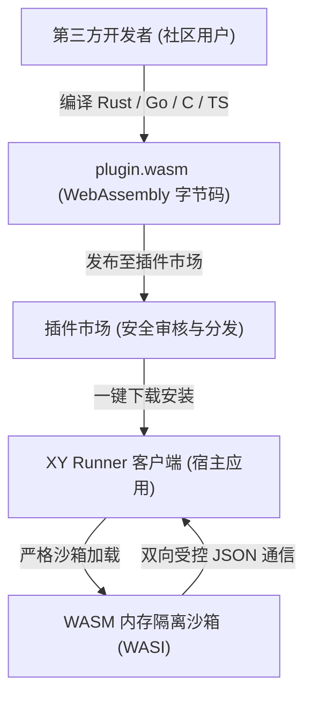

# XY Runner WebAssembly (WASM) 插件开发者完全指南

欢迎来到 **XY Runner 开放插件生态**！

XY Runner 是一款现代化的高性能桌面自动化与工作流编排系统。为了向全球第三方开发者与社区用户提供**绝对安全、跨平台一次编写处处运行 (Write Once, Run Everywhere)、极致轻量**的扩展能力，XY Runner 开放生态**全面基于 WebAssembly (WASI) 沙箱技术构建**。

本文档将带领您从零开始，在 10 分钟内完成一个高质量、跨平台的 WASM 动作插件的开发、调试、本地加载与市场发布。

---

## 1. 为什么选择 WebAssembly？(Why WASM?)

与传统桌面软件要求用户下载并运行未知的 `.dll` / `.exe` 不同，XY Runner 坚决捍卫用户的数据安全与系统稳定性：



1. **绝对安全隔离 (Sandbox Isolation)**：
   - 插件运行在独立的 WebAssembly 虚拟机沙箱内，无法直接恶意读取用户硬盘、注册表或随意发起未经授权的底层网络窃密；
   - 彻底杜绝传统原生动态库常见的内存越界、跨堆崩溃或“一个插件崩溃导致整个主程序闪退”的致命缺陷。
2. **真正的跨平台一致性 (True Cross-Platform)**：
   - 您只需编译**一份 `.wasm` 文件**，即可无缝在 Windows、macOS (Intel & Apple Silicon M系列)、Linux 等所有平台上一致运行，无需为每个平台配置特定的交叉编译工具链。
3. **极速冷启动与极致轻巧**：
   - 典型 WASM 插件经过优化后体积仅有几十 KB 至几百 KB，启动耗时仅微秒级，内存开销微乎其微。

---

## 2. 开发前置准备 (Prerequisites)

我们推荐使用目前生态最健全的 **Rust** 语言进行开发（亦支持 Go/TinyGo、AssemblyScript、C/C++）。

### 2.1 安装 Rust 工具链
如果您尚未安装 Rust，可通过官方脚本安装：
- **Windows / macOS / Linux**: [https://rustup.rs/](https://rustup.rs/)

### 2.2 安装 WebAssembly 编译目标
在终端执行以下指令，添加标准的 `wasm32-wasip1`（推荐）与 `wasm32-unknown-unknown` 目标：
```bash
rustup target add wasm32-wasip1 wasm32-unknown-unknown
```

---

## 3. 5 分钟上手：构建第一个插件 (Quick Start)

### 3.1 创建工程
在任意空目录下，创建一个标准的 Rust 库工程：
```bash
cargo new --lib my_wasm_plugin
cd my_wasm_plugin
```

### 3.2 配置 `Cargo.toml`
编辑 `Cargo.toml`，声明编译为 `cdylib` 并启用编译体积优化：
```toml
[package]
name = "my_wasm_plugin"
version = "1.0.0"
edition = "2024"

[lib]
crate-type = ["cdylib", "rlib"]

[workspace]

[dependencies]
serde = { version = "1.0", features = ["derive"] }
serde_json = "1.0"

[profile.release]
opt-level = "z"     # 针对二进制体积优化
lto = true          # 启用跨模块链路优化
codegen-units = 1   # 最大化代码合并
panic = "abort"     # 移除展开以减少体积
strip = true        # 剥离调试符号
```

### 3.3 编写元数据清单 `manifest.json`
在工程根目录下创建 `manifest.json`，用于指导宿主系统自动生成 UI 输入面板与大模型意图提取：
```json
{
  "plugin_id": "my_wasm_plugin",
  "name": "我的首个插件",
  "version": "1.0.0",
  "description": "基于 WebAssembly 演示简单的文本反转与字数统计",
  "group": "自定义 (Custom)",
  "group_icon": "✨",
  "order": 100,
  "actions": [
    {
      "tag": "ReverseText",
      "display_name": "文本反转器 (Reverse Text)",
      "icon": "🔄",
      "description": "将输入文本内容倒序反转，并计算字符总数",
      "keywords": ["reverse", "text", "反转", "文本"],
      "fields": [
        {
          "name": "input_text",
          "display_name": "输入文本",
          "intrinsic_type": "string",
          "default_type": "string",
          "default_value": "Hello XY Runner",
          "presets": ["Hello XY Runner", "123456789"],
          "description": "需要反转处理的原始文本"
        }
      ],
      "output_type": "string"
    }
  ]
}
```

### 3.4 编写核心逻辑 `src/lib.rs`
```rust
use serde::{Deserialize, Serialize};
use std::collections::HashMap;

#[derive(Deserialize)]
struct WasmInput {
    action_tag: String,
    #[serde(default)]
    data: HashMap<String, serde_json::Value>,
}

#[derive(Serialize)]
struct WasmOutput {
    success: bool,
    #[serde(skip_serializing_if = "Option::is_none")]
    error: Option<String>,
    #[serde(skip_serializing_if = "Option::is_none")]
    output: Option<String>,
    set_variables: HashMap<String, String>,
}

// ----------------------------------------------------------------------------
// 业务动作实现
// ----------------------------------------------------------------------------
fn run_reverse_text(data: &HashMap<String, serde_json::Value>) -> Result<(String, HashMap<String, String>), String> {
    let raw = data.get("input_text")
        .and_then(|v| v.as_str())
        .unwrap_or("");
    
    let reversed: String = raw.chars().rev().collect();
    let mut vars = HashMap::new();
    vars.insert("reversed_result".to_string(), reversed.clone());

    let payload = serde_json::json!({
        "status": "success",
        "length": raw.len(),
        "reversed": reversed
    });

    Ok((payload.to_string(), vars))
}

// ----------------------------------------------------------------------------
// WASM 内存通信导出函数 (标准契约)
// ----------------------------------------------------------------------------
#[unsafe(no_mangle)]
pub extern "C" fn xy_wasm_get_manifest() -> *const u8 {
    static MANIFEST: &str = include_str!("../manifest.json");
    MANIFEST.as_ptr()
}

#[unsafe(no_mangle)]
pub extern "C" fn xy_wasm_get_manifest_len() -> usize {
    static MANIFEST: &str = include_str!("../manifest.json");
    MANIFEST.len()
}

#[unsafe(no_mangle)]
pub extern "C" fn xy_wasm_alloc(size: usize) -> *mut u8 {
    let mut buf = Vec::with_capacity(size);
    let ptr = buf.as_mut_ptr();
    std::mem::forget(buf);
    ptr
}

#[unsafe(no_mangle)]
pub extern "C" fn xy_wasm_dealloc(ptr: *mut u8, size: usize) {
    if !ptr.is_null() && size > 0 {
        unsafe { let _ = Vec::from_raw_parts(ptr, 0, size); }
    }
}

#[unsafe(no_mangle)]
pub extern "C" fn xy_wasm_execute(input_ptr: *const u8, input_len: usize) -> *mut u8 {
    let input_bytes = unsafe { std::slice::from_raw_parts(input_ptr, input_len) };
    let (output_str, set_vars) = match serde_json::from_slice::<WasmInput>(input_bytes) {
        Ok(req) if req.action_tag == "ReverseText" => match run_reverse_text(&req.data) {
            Ok(res) => (Some(res.0), res.1),
            Err(e) => return pack_error(&e),
        },
        Ok(req) => return pack_error(&format!("Unknown action tag: {}", req.action_tag)),
        Err(e) => return pack_error(&format!("JSON Parse error: {}", e)),
    };

    let out = WasmOutput {
        success: true,
        error: None,
        output: output_str,
        set_variables: set_vars,
    };
    pack_output(&out)
}

fn pack_error(err: &str) -> *mut u8 {
    pack_output(&WasmOutput {
        success: false,
        error: Some(err.to_string()),
        output: None,
        set_variables: HashMap::new(),
    })
}

fn pack_output(out: &WasmOutput) -> *mut u8 {
    let json_bytes = serde_json::to_vec(out).unwrap_or_default();
    let len = json_bytes.len() as u32;
    let mut full = Vec::with_capacity(4 + json_bytes.len());
    full.extend_from_slice(&len.to_le_bytes());
    full.extend_from_slice(&json_bytes);
    let ptr = full.as_mut_ptr();
    std::mem::forget(full);
    ptr
}
```

### 3.5 编译生成 `.wasm` 产物
在终端执行编译命令：
```bash
cargo build --target wasm32-wasip1 --release
```
编译产物将生成在 `target/wasm32-wasip1/release/my_wasm_plugin.wasm`。

---

## 4. 单动作模式 vs 多动作套件模式 (Single vs Multi-Action)

XY Runner 同时支持两种组织模式：

### 4.1 单动作极简模式 (适合独立微小工具)
- **Manifest**: 在根级声明 `tag`、`display_name` 与 `fields`：
  ```json
  {
    "plugin_id": "simple_tool",
    "tag": "MyTool",
    "display_name": "简单工具",
    "fields": [...]
  }
  ```
- **UI 呈现**：在动作库中仅作为一个单独的动作节点出现。

### 4.2 多动作套件模式 (推荐：适合功能组合工具箱)
- **Manifest**: 在根级声明 `actions` 数组：
  ```json
  {
    "plugin_id": "my_suite",
    "name": "多功能套件",
    "actions": [
      { "tag": "ActionA", "display_name": "子动作 A", "fields": [...] },
      { "tag": "ActionB", "display_name": "子动作 B", "fields": [...] }
    ]
  }
  ```
- **WASM 分发逻辑**：根据传入的 `action_tag` 匹配分发：
  ```rust
  match input.action_tag.as_str() {
      "ActionA" => run_action_a(&input.data),
      "ActionB" => run_action_b(&input.data),
      _ => Err("Unknown tag".to_string()),
  }
  ```
- **UI 呈现**：该分类下将自动展开显示所有子动作卡片。

---

## 5. 多语言国际化规范 (Plugin i18n Guide)

XY Runner 拥有原生多语言架构。您只需在插件目录下建立 `locales/` 目录，即可轻松实现全球化多语言界面！

### 5.1 目录组织
```
my_plugin/
├── manifest.json       # 默认英文或基准元数据
└── locales/
    ├── zh_CN.json      # 简体中文补丁
    ├── en.json         # 英文对照
    └── ja.json         # 日语对照 (可选)
```

### 5.2 编写 `locales/zh_CN.json`
系统将在运行时自动读取并覆盖对应语言的显示名称、描述与预设项文本：
```json
{
  "name": "我的工具箱",
  "description": "中文插件功能说明",
  "actions": {
    "ReverseText": {
      "display_name": "文本反转器",
      "description": "倒序反转输入文本",
      "fields": {
        "input_text": {
          "display_name": "输入文本",
          "description": "待处理的原字符串"
        }
      }
    }
  }
}
```

---

## 6. 通信数据协议与变量回写 (Protocol & Context Variables)

### 6.1 宿主发送给插件的请求 (Input JSON)
```json
{
  "action_tag": "ReverseText",
  "data": {
    "input_text": "Hello World"
  },
  "variables": {
    "global_api_token": "xyz123"
  }
}
```

### 6.2 插件返回给宿主的响应 (Output JSON)
```json
{
  "success": true,
  "output": "{\"status\":\"success\",\"reversed\":\"dlroW olleH\"}",
  "set_variables": {
    "reversed_result": "dlroW olleH"
  }
}
```
> [!TIP]
> 插件在 `set_variables` 中回写的所有键值对，都会立即写入当前工作流的执行上下文 `ExecutionContext`，供随后的后续节点（如判断分支、发送邮件、文件保存等）通过引用变量直接读取！

---

## 7. 官方标准多动作示例工程 (`xy_wasm_crypto`)

在本文档同级目录下的 [`demo/`](./demo/) 中，官方提供了完备可直接编译的多动作加解密示例工程：
- **动作清单**：
  1. `CalculateHash` (MD5 / SHA-256 / SHA-1 计算与大写控制)
  2. `Base64Codec` (Base64 编码与解码)
  3. `UrlCodec` (URL 百分号转义与解码)
- **多语言**：内置 `locales/zh_CN.json` 与 `locales/en.json`
- **自动化测试**：包含 6 个覆盖全部动作的完整单元测试。

进入该目录即可直接体验：
```bash
cd demo
cargo test
cargo build --target wasm32-wasip1 --release
```

---

## 8. 本地调试与上架发布 (Testing & Publishing)

### 8.1 本地测试安装
将编译生成的 `.wasm` 重命名为 `plugin.wasm`，与 `manifest.json` 一并放置在系统用户插件目录下：
- **Windows**: `C:\Users\<用户名>\.xy-app\plugins\<plugin_id>\plugin.wasm`
- **macOS / Linux**: `~/.xy-app/plugins/<plugin_id>/plugin.wasm`

启动 XY Runner 即可在动作面板中看到并调试您的新插件。

### 8.2 插件市场上架发布规范
准备上架到官方插件市场时，请确保：
1. **纯净 WASM**：仅上传 `.wasm` 字节码文件与 `manifest.json` 清单（严禁上传原生动态库）；
2. **生成 SHA-256 完整性哈希**：
   ```bash
   sha256sum plugin.wasm
   ```
3. **版本规范**：遵循语义化版本 (SemVer，如 `1.0.0`)；
4. 提交至官方插件市场审核仓库，即可面向全球用户分发！
